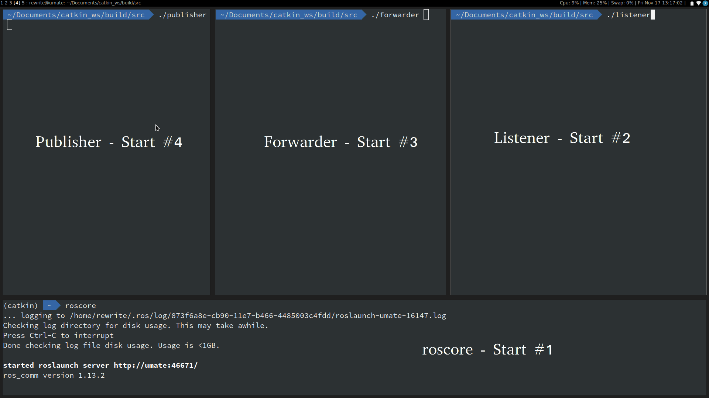

# ROS Template(s)

There are three templates explained which define the following communication structure:

```
 _______________              ________________          _______________
|               |            |                |        |               |
|               |            |                |        |               |
|  Subscriber   | (modified) |    Forwarder   |        |   Publisher   |
|  (read only)  | <========= | (read + write) | <===== | (write only)  |
|               |            |                |        |               |
|_______________|            |________________|        |_______________|
```

This is a *non-trivial* example for a setup, because you will understand the basics anyways and this might be useful for a pipelined processing of data.

Unfortunately, the examples in the official ROS wiki are horrendous and provide [the worst possible template to start development with ROS](http://wiki.ros.org/ROS/Tutorials/WritingPublisherSubscriber%28c%2B%2B%29).

We don't want explicit `while (true)` loops without encapsulation and unnecessary multiple subscriptions to a channel. At least `c++11` would be nice too, right?

### Step 1 - Install ROS

Because the docs for that are pretty easy to follow, I won't get into detail. Just follow [this guide](http://wiki.ros.org/lunar/Installation). This should look like this (I'm on Ubuntu, ZSH and installing the barebones version)

```bash
> sudo sh -c 'echo "deb http://packages.ros.org/ros/ubuntu $(lsb_release -sc) main" > /etc/apt/sources.list.d/ros-latest.list'
> sudo apt-key adv --keyserver hkp://ha.pool.sks-keyservers.net:80 --recv-key 421C365BD9FF1F717815A3895523BAEEB01FA116
> sudo apt-get update
> sudo apt-get install ros-lunar-ros-base
> sudo rosdep init
> rosdep update
> echo "source /opt/ros/lunar/setup.zsh" >> ~/.zshrc
> source ~/.zshrc
> sudo apt-get install python-rosinstall python-rosinstall-generator python-wstool build-essential
```

### Step 2 - Create a Catkin workspace

Go anywhere you want to have your global `catkin_ws` folder.

```bash
> mkdir -p catkin_ws/src
> cd catkin_ws
> catkin_make
...
```

### Step 2.1 - Problems

#### Problem 1

If you're already using `anaconda` you might encounter this error:

```python
ImportError: "from catkin_pkg.package import parse_package" failed: No module named 'catkin_pkg'
Make sure that you have installed "catkin_pkg", it is up to date and on the PYTHONPATH.
```

That means that ROS need to have a python version `2.7`, but yours doesn't match. Just create a new environment with python version `2.7` and install the tool `catkin_pkg`.

```bash
> conda create --name catkin python=2.7
> source activate catkin
> conda install -c auto catkin_pkg
```

Everytime you want to use catkin you will need to activate the environment. **Don't forget to delete the `build` folder**. Otherwise there will be caching and the problem won't be solved 

#### Problem 2

Still using `anaconda` and see this?

```bash
- The manifest must not contain the following tags: depend, build_export_depend, buildtool_export_depend
CMake Error at /opt/ros/lunar/share/catkin/cmake/safe_execute_process.cmake:11 (message):
```

This means the anaconda packages are too old to work with your ROS version. Do this:

```bash
> pip install -U rosdep rosinstall_generator wstool rosinstall six vcstools
> conda install setuptools
```

Now `catkin_make` should work.

### After `catkin_make`

Check that your current path is also in environement by `echo $ROS_PACKAGE_PATH`. It should look like this:

```bash
> echo $ROS_PACKAGE_PATH
/home/rewrite/Documents/catkin_ws/src:/opt/ros/lunar/share
```

If not, execute `source devel/setup.zsh` (or `setup.bash` if you don't have `zsh`)

**Before running ROS executables** you need have run `roscore` running in a terminal. To have it running in the background:

```bash
> roscore &
```

### Step 3.1 - Create a Package (optional)

If you want to create your own project, do this:

```bash
> cd catkin_ws
> cd src
> catkin_create_pkg [name] std_msgs roscpp [other-dependencies]
> cd ..
> catkin_make
```

But you don't have any code yet to compile so there's no executable to run.

You can copy-paste some [source code](https://raw.githubusercontent.com/ros/ros_tutorials/kinetic-devel/roscpp_tutorials/talker/talker.cpp) into `catkin_ws/src/[package-name]/src/example.cpp`, which has a `main()` function.
To compile it and run it you have to modify the `catkin_ws/src/[package-name]/CMakeLists.txt` file.

Append the following code to the `CMakeLists.txt` file:

```cmake
add_executable(example src/example.cpp)
target_link_libraries(example ${catkin_LIBRARIES})
```

Now it you should have some highlighted linking steps where you see the executable location:


The executable are located in `catkin_ws/devel/lib/[package-name]/[executable-name]`. Unfortunately, this will (probably) only be the case if you have one big `CMakeLists.txt` which I'm refusing to use because we want to be able to just copy/paste other `cmake` projects into our `catkin` projects. 

### Step 3.2 - How to use this project

So, because of this structure of `catkin` it's a slightly other approach to encapsulate packages. To use `git` to it's fullest, I provide exactly this package which you have to clone into `catkin_ws/src`.

```bash
> cd catkin_ws/src
> git clone https://github.com/ros-template
```

Now change the name and configure it to your desire:

```bash
> mv ros-template [my-package-name]
> vim [my-package-name]/CMakeLists.txt # modify PROJECT_NAME
> vim [my-package-name]/package.xml    # (optional) modify maintainer
```

The `CMakeLists.txt` should be self-explanatory, as well as the nested ones in `src` and `test`.

**Compiling**

```bash
catkin_ws> catkin_make
```

**Running** - open three terminals, navigate to `catkin_make/build/src` and run `publisher`, `forwarder` and `subscriber` in the terminals while `roscore` is running in the background.




**Tests** - `catkin_make/build/test`, you should see a `simple_test` executable. Check out [the official docs](https://github.com/catchorg/Catch2) to use it for more than basic unit tests.


### Changed settings

I changed some default settings for this package and here's the summary:

*  Template was created with `catkin_create_pkg rostemplate roscpp std_msg`

* `CMakeLists.txt`
    * `:6` - added DEBUG flag
    * `:8` - set compiler
    * `:14` - set c++11 standart
    * `:17-21` - different compilation depending on DEBUG_MODE flag
    * `:24-25` - define recursive CMakeLists.txt

* `src/utils.hpp` - added a `DEBUG(msg)` macro which will can be disabled by compiling with `catkin_make --source [package-name] -DDEBUG_MODE=0`

* I hopefully adapted the `CMakeLists.txt` such that you may simply add `add_subdirectory([cmake-project])` and it will work. Insert it before the following snippet, so you can use the `target_link_libraries([cmake-project-lib])` in the `src` and `test` directories.

```cmake
# add the code
add_subdirectory(src)
add_subdirectory(test)
```

